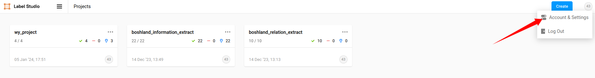
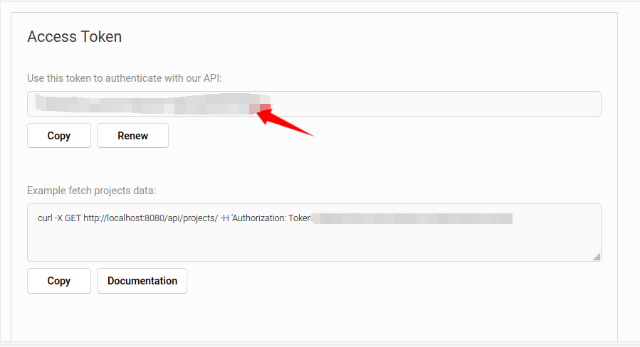
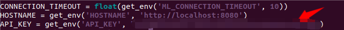
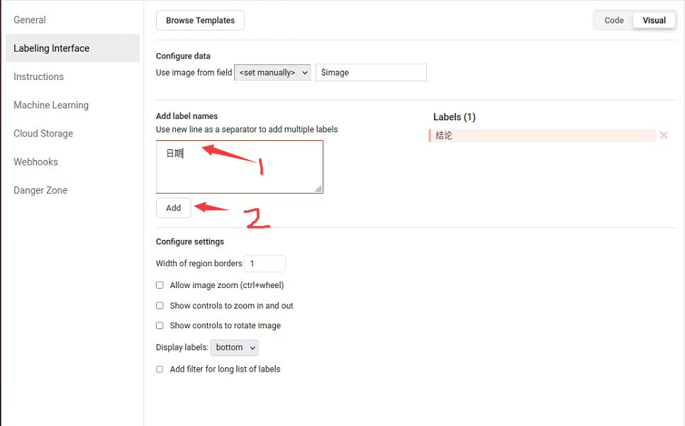
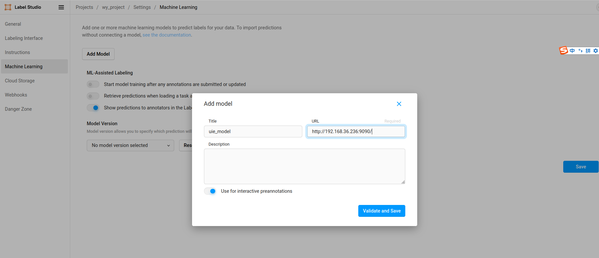
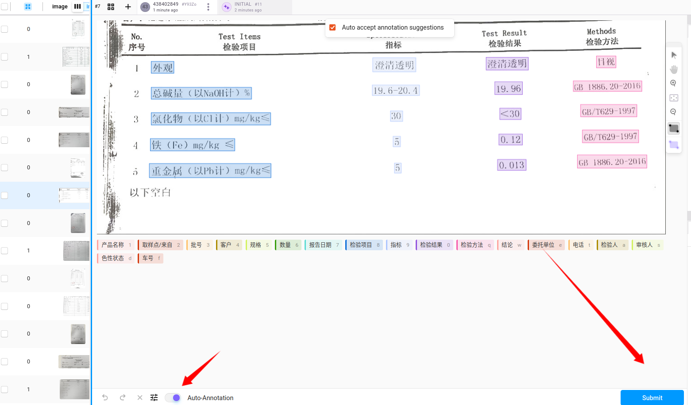

- [环境安装](#环境安装)
  - [docker 拉取](#docker-拉取)
  - [安装必要的包](#安装必要的包)
  - [生成 requirements.txt](#生成-requirementstxt)
- [创建后端服务](#创建后端服务)
  - [主要方法](#主要方法)
  - [init方法初始化](#init方法初始化)
  - [predict 预测方法](#predict-预测方法)
  - [fit 训练方法](#fit-训练方法)
  - [其他方法](#其他方法)
  - [本例下完整 model.py 代码](#本例下完整-modelpy-代码)
  - [报错情况](#报错情况)
- [使用流程](#使用流程)
  - [启动 Label-studio 及后端服务 Backend](#启动-label-studio-及后端服务-backend)
  - [半自动标注及一键训练](#半自动标注及一键训练)
  - [API 服务](#api-服务)

---

## 环境安装

### docker 拉取

[paddlepaddle/paddle镜像文件](https://hub.docker.com/r/paddlepaddle/paddle/tags/?page=1)

```bash
# 拉取镜像
docker pull xxxx
nvidia-docker pull xxxx
# 运行容器
# cpu
docker run --name ppnlp_cpu -v $PWD:/home --network=host -it registry.baidubce.com/paddlepaddle/paddle:2.4.0-cpu /bin/bash
# gpu
nvidia-docker run --gpus all --name ppnlp_gpu -v $PWD:/home --network=host -it registry.baidubce.com/paddlepaddle/paddle:latest-dev-cuda11.6-cudnn8.4-trt8.4-gcc82 /bin/bash
```

+  --name ppnlp_gpu：设定 Docker 的名称，ppnlp 是自己设置的名称；
+ -it：参数说明容器已和本机交互式运行；
+ -v $PWD:/paddle：指定将当前路径（PWD 变量会展开为当前路径的绝对路径--Linux宿主机的路径，所以执行命令的路径要选好）挂载到容器内部的 /paddle 目录；（相当于 /opt/ppnlp 挂载到容器内）
+ registry.baidubce.com/paddlepaddle/paddle:2.4.0-cpu：指定需要使用的 image 名称，您可以通过docker images命令查看；
+ /bin/bash 是在 Docker 中要执行的命令

进入容器

```bash
# cpu
docker exec -it ppnlp_gpu /bin/bash
# gpu
docker exec -it ppnlp_gpu /bin/bash
```

### 安装必要的包

```bash
# 安装 paddlepaddle 具体版本见[paddlepaddle版本](https://www.paddlepaddle.org.cn/whl/linux/mkl/avx/stable.html)
# cpu版已自带 paddlepaddle 2.4.0 ，无需安装 paddlepaddle
# gpu 推荐2.5.0
python3 -m pip install paddlepaddle-gpu==2.5.0 -f https://www.paddlepaddle.org.cn/whl/linux/mkl/avx/stable.html
# python3 -m pip install paddlepaddle-gpu==2.4.2.post116 -f https://www.paddlepaddle.org.cn/whl/linux/mkl/avx/stable.html
# 升级 pip 
pip install -U pip -i https://mirror.baidu.com/pypi/simple
# 安装 PaddleNLP
pip install paddlenlp==2.5.2 -i https://mirror.baidu.com/pypi/simple
# 安装 PaddleOCR
pip install paddleocr -i https://mirror.baidu.com/pypi/simple
```

[label-studio](https://labelstud.io/guide/get_started.html#Quick-start) | [label-studio-ml](https://github.com/HumanSignal/label-studio-ml-backend)

```cmd
pip install label_studio
pip install label_studio_ml==1.0.9
```

将Label Studio 与机器学习模型集成。Label Studio ML 后端是一个 SDK，可用于打包机器学习模型代码并将其转换为 Web 服务器。机器学习服务器使用 uWSGI 和 supervisord ，并使用 RQ 处理后台训练作业。

```bash
apt-get install tree 
pip install protobuf==3.20.2
pip install paddle_serving_client
# 可能存在 numpy 版本过新，执行以下语句
pip uninstall numpy
pip install numpy
```

### 生成 requirements.txt

```bash
pip install pipreqs
pipreqs . --force
###
label_studio_ml==1.0.9
numpy==1.21.6
opencv_contrib_python==4.6.0.66
opencv_python==4.6.0.66
paddle_serving_client==0.9.0
paddlenlp==2.7.1
paddlepaddle==2.5.0rc0
Requests==2.31.0
###
```

---

## 创建后端服务

[label-studio官方文档 Write your own ML backend](https://labelstud.io/guide/ml_create.html)

### 主要方法

自定义`model.py`文件，其主要包含一个继承自 LabelStudioMLBase 的类。重写三个方法，官方示例： [model.py](https://github.com/HumanSignal/label-studio-ml-backend/blob/master/label_studio_ml/examples/the_simplest_backend/model.py#L22) 。

```python
class NewModel(LabelStudioMLBase):
        
    def __init__(self, label_config=None, train_output=None, **kwargs):
        super(model, self).__init__(**kwargs)
        """ Define and initialize required variables."""

    def predict(self, tasks: List[Dict], context: Optional[Dict] = None, **kwargs) -> List[Dict]:
        """ Write your inference logic here
            :param tasks: [Label Studio tasks in JSON format](https://labelstud.io/guide/task_format.html)
            :param context: [Label Studio context in JSON format](https://labelstud.io/guide/ml.html#Passing-data-to-ML-backend)
            :return predictions: [Predictions array in JSON format](https://labelstud.io/guide/export.html#Raw-JSON-format-of-completed-tasks)
        """
        print(f'''\
        Run prediction on {tasks}
        Received context: {context}
        Project ID: {self.project_id}
        Label config: {self.label_config}
        Parsed JSON Label config: {self.parsed_label_config}''')
        return []

    def fit(self, event, data, **kwargs):
        """
        This method is called each time an annotation is created or updated
        You can run your logic here to update the model and persist it to the cache
        It is not recommended to perform long-running operations here, as it will block the main thread
        Instead, consider running a separate process or a thread (like RQ worker) to perform the training
        :param event: event type can be ('ANNOTATION_CREATED', 'ANNOTATION_UPDATED')
        :param data: the payload received from the event (check [Webhook event reference](https://labelstud.io/guide/webhook_reference.html))
        """

        # use cache to retrieve the data from the previous fit() runs
        old_data = self.get('my_data')
        old_model_version = self.get('model_version')
        print(f'Old data: {old_data}')
        print(f'Old model version: {old_model_version}')

        # store new data to the cache
        self.set('my_data', 'my_new_data_value')
        self.set('model_version', 'my_new_model_version')
        print(f'New data: {self.get("my_data")}')
        print(f'New model version: {self.get("model_version")}')
        print('fit() completed successfully.')

```

### init方法初始化

导入依赖库

```python 
import os
import requests
from label_studio.core.utils.params import get_env
from label_studio_ml.model import LabelStudioMLBase
from label_studio.core.settings.base import DATA_UNDEFINED_NAME
from label_studio_ml.utils import get_single_tag_keys
from paddlenlp import Taskflow
import base64
import json
import cv2
import secrets
import string

# Set environment variables
os.environ["LABEL_STUDIO_ML_BACKEND_V2"] = "True"
CONNECTION_TIMEOUT = float(get_env('ML_CONNECTION_TIMEOUT', 10))
HOSTNAME = get_env('HOSTNAME', 'http://localhost:8080')
API_KEY = get_env('API_KEY', "your_api_key")
```

`LabelStudioMLBase` 类提供了以下[几个可供使用的特殊变量](https://labelstud.io/guide/ml_create.html#Variables-available-from-LabelStudioMLBase)：

- self.parsed_label_config: 为项目提供结构化的 Label Studio 标签配置。

本例中标签配置：

```html
<View>
  <Image name="image" value="$image"/>
  <RectangleLabels name="label" toName="image">
    <Label value="日期" background="#FFA39E"/>
    ...
    <Label value="结论" background="#AD8B00"/>
  </RectangleLabels>
</View>
```

标签配置对应的`parsed_label_config`:

```json
{
  "日期": {
    "value": "日期",
    "background": "#FFA39E"
  },
  ...
  "结论": {
    "value": "结论",
    "background": "#FFA39E"
  }
}

```

根据需要从 `self.parsed_label_config` 变量中提取需要的信息，并通过 PaddleNLP 的 Taskflow 加载用于预标注的模型。

```python
class MyModel(LabelStudioMLBase):
     def __init__(self, **kwargs):
        super(MyModel, self).__init__(**kwargs)

        # Get single tag keys and initialize variables
        self.from_name, self.to_name, self.value, self.labels_in_config = get_single_tag_keys(
            self.parsed_label_config, 'RectangleLabels', 'Image')
        self.labels_in_config = set(self.labels_in_config)

        # Initialize information extraction taskflow
        self.model = Taskflow("information_extraction", schema=self.labels_in_config, model="uie-x-base",
                           task_path='../checkpoint/model_best')
```

### predict 预测方法

重写方法 `predict(tasks, **kwargs)` 。该方法接受 [JSON 格式的 Label Studio 任务](https://labelstud.io/guide/tasks.html#Basic-Label-Studio-JSON-format) 并以 [Label Studio 接受的格式](https://labelstud.io/guide/predictions.html) 返回预测。	

本例中`predict()`方法的参数`tasks`格式如下，重点查看`result`字段：

```json
{
  "id": 21,
  "data": {
    "image": "/data/upload/6/053e5ecd-test05_crop_table.png"
  },
  "annotations": [
    {
      "id": 19,
      "created_username": "<your_email>, 1",
      "created_ago": "3 weeks, 4 days",
      "completed_by": {
        "id": 1,
        "first_name": "",
        "last_name": "",
        "avatar": null,
        "email": "<your_email>",
        "initials": "43"
      }, 
		"result": [
        {
          "original_width": 1136,
          "original_height": 674,
          "image_rotation": 0,
          "value": {
            "x": 8.714788732394366,
            "y": 17.50741839762611,
            "width": 5.63380281690141,
            "height": 4.154302670623149,
            "rotation": 0,
            "rectanglelabels": [
              "日期"
            ]
          },
          "id": "-4WH5hjwCw",
          "from_name": "label",
          "to_name": "image",
          "type": "rectanglelabels",
          "origin": "manual"
        },
     	......
        {
          "original_width": 1136,
          "original_height": 674,
          "image_rotation": 0,
          "value": {
            "x": 80.39917275945292,
            "y": 71.09910839752142,
            "width": 13.84594379378039,
            "height": 5.687844986000111,
            "rotation": 0,
            "rectanglelabels": [
              "结论"
            ]
          },
          "id": "pVdPsoR7J5",
          "from_name": "label",
          "to_name": "image",
          "type": "rectanglelabels",
          "origin": "manual"
        }
      ],
	"predictions": [
    {
      "id": 1,
      "model_version": "INITIAL",
      "created_ago": "4 days, 19 hours",
      "result": [],
      "score": 0,
      "cluster": null,
      "neighbors": null,
      "mislabeling": 0,
      "created_at": "2024-01-04T07:46:02.737697Z",
      "updated_at": "2024-01-04T07:46:02.737715Z",
      "task": 21
    }
  ]
}
```

> 重点关心 **result** 字段，from_name,to_name,type,origin在**`init()`**方法中获取，而 **value** 字典和 original_width, original_height, image_rotation 需经过模型预测后从返回的 json 格式文件中获取。

从 uie 预测结果中提取相应的字段，构成 Label Studio 接受的预注释格式。命名实体识别任务的具体预注释示例可参考 [Import span pre-annotations for text](https://labelstud.io/guide/predictions.html#Import-span-pre-annotations-for-text)。

更多其他类型任务的具体预注释示例可参考 [Specific examples for pre-annotations](https://labelstud.io/guide/predictions.html#Specific-examples-for-pre-annotations)。

```python
def predict(self, tasks, **kwargs):
    """Perform inference: get predictions of tasks from your model on-the-fly while annotating."""
    from_name = self.from_name
    to_name = self.to_name
    task = tasks[0]

    # Get image URL and local path
    image_url = self._get_image_url(task)
    image_path = self.get_local_path(image_url, "/images")

    # Run inference on the detector
    model_results, original_height, original_width = self._inference_detector(image_path)

    # Prepare annotation results
    result = []
    predictions = []

    for item_list in model_results:
        for label, annotations in item_list.items():
            for annotation in annotations:
                # Create result item
                result_item = {
                    "original_width": original_width,
                    "original_height": original_height,
                    "image_rotation": 0,
                    "value": {
                        "x": (annotation['bbox'][0][0] / original_width) * 100,
                        "y": (annotation['bbox'][0][1] / original_height) * 100,
                        "width": ((annotation['bbox'][0][2] - annotation['bbox'][0][0]) / original_width) * 100,
                        "height": ((annotation['bbox'][0][3] - annotation['bbox'][0][1]) / original_height) * 100,
                        "rotation": 0,
                        "rectanglelabels": [label]
                    },
                    "id": self.generate_random_id()
                    "from_name": from_name,
                    "to_name": to_name,
                    "type": "rectanglelabels",
                    "origin": "manual"
                }
                result.append(result_item)

        # Sort result based on x-coordinate
        result = sorted(result, key=lambda k: k["value"]["x"])

        # Append predictions
        predictions.append({
            'result': result,
            'model_version': 'uie-model V1.0'
        })

    return predictions
```

> 这里在写json格式的时候，关于 value 下的 id 是自己随机生成的12位，这块不是很懂，难道不应该该是 label-studio 来生成，不懂啊~

### fit 训练方法

编写代码覆盖 `fit()` 方法。`fit()` 方法接受 [JSON 格式的 Label Studio 注释](https://labelstud.io/guide/export.html#Label-Studio-JSON-format-of-annotated-tasks) 并返回任意一个可以存储模型相关信息的 JSON 字典。

```python
def fit(self, annotations, workdir=None, **kwargs):
    """ This is where training happens: train your model given list of annotations,
        then returns dict with created links and resources.
    """
    print("fit start ......")
    # Convert annotations to a list and save them to a JSON file
    annotations_list = list(annotations)
    with open("./label_studio_update.json", "w", encoding="utf-8") as outfile:
        json.dump(annotations_list, outfile, ensure_ascii=False)
	
    # Run Label Studio for data preprocessing
    os.system('python label_studio.py \
        --label_studio_file ./label_studio_update.json \
        --task_type "ext" \
        --save_dir ./data \
        --splits 0.8 0.1 0.1')
	
    # Run fine-tuning script
    os.system('python finetune.py  \
                --device gpu \
                --logging_steps 5 \
                --save_steps 25 \
                --eval_steps 25 \
                --seed 42 \
                --model_name_or_path uie-x-base \
                --output_dir ./checkpoint/model_best \
                --train_path data/train.txt \
                --dev_path data/dev.txt  \
                --max_seq_len 512  \
                --per_device_train_batch_size  4 \
                --per_device_eval_batch_size 4 \
                --num_train_epochs 1 \
                --learning_rate 1e-5 \
                --do_train \
                --do_eval \
                --do_export \
                --export_model_dir ./checkpoint/model_best \
                --overwrite_output_dir \
                --disable_tqdm True \
                --metric_for_best_model eval_f1 \
                --load_best_model_at_end  True \
                --save_total_limit 1')
    print("fit end ......")
    return {
        'path': workdir
    }
```

###  其他方法

```python
def _inference_detector(self, image_path):
        """Inference on a single image using a detector.
        Args:
            image_path (str): Path to the image file.
        Returns:
            tuple: Tuple containing inference results, original image height, and original image width.
        """
        # Read the image
        img = cv2.imread(image_path)
        # Get the original height and width
        orig_height, orig_width, _ = img.shape
        # Convert the image to Base64 encoding
        _, img_encoded = cv2.imencode(".jpg", img)
        img_base64 = base64.b64encode(img_encoded.tobytes()).decode("utf-8")
        # Pass Base64 encoded image to the inference engine 'ie'
        results = self.ie({"doc": img_base64})
        return results, orig_height, orig_width

def _get_image_url(self, task):
    """Get the image URL from the task data.
    Args:
        task (dict): Task data.
    Returns:
        str: Image URL.
    """
    image_url = task['data'].get(self.value) or task['data'].get(DATA_UNDEFINED_NAME)
    return image_url

def generate_random_id(self, length=12):
    """Generates a random identifier with a specified length."""
    # Define the set of characters to be used for generating the random identifier
    characters = string.ascii_letters + string.digits + "_"
    # Use secrets.choice to select random characters and join them to form the identifier
    random_id = ''.join(secrets.choice(characters) for _ in range(length))
    return random_id
```

### 本例下完整 model.py 代码

```python
class NewModel(LabelStudioMLBase):
    def __init__(self, **kwargs):
        super(NewModel, self).__init__(**kwargs)
        self.model = None
        self.from_name, self.to_name, self.value, self.labels_in_config = get_single_tag_keys(
            self.parsed_label_config, 'RectangleLabels', 'Image')
        self.labels_in_config = set(self.labels_in_config)

    def _init(self):
        if self.model is None:
            self.model = Taskflow("information_extraction", schema=self.labels_in_config,
                                  task_path='./checkpoint/model_best')

    def generate_random_id(self, length=12):
        characters = string.ascii_letters + string.digits + "_"
        random_id = ''.join(secrets.choice(characters) for _ in range(length))
        return random_id

    def _inference_detector(self, image_path):
        img = cv2.imread(image_path)
        orig_height, orig_width, _ = img.shape
        # Convert the image to Base64 encoding
        _, img_encoded = cv2.imencode(".jpg", img)
        img_base64 = base64.b64encode(img_encoded.tobytes()).decode("utf-8")
        # Pass Base64 encoded image to the inference engine 'model'
        results = self.model({"doc": img_base64})
        return results, orig_height, orig_width

    def _get_image_url(self, task):
        image_url = task['data'].get(self.value) or task['data'].get(DATA_UNDEFINED_NAME)
        return image_url

    def predict(self, tasks, **kwargs):
        self._init()
        from_name = self.from_name
        to_name = self.to_name
        task = tasks[0]
        # Get image URL and local path
        image_url = self._get_image_url(task)
        image_path = self.get_local_path(image_url, "/images")
        # Run inference on the detector
        model_results, original_height, original_width = self._inference_detector(image_path)
        # Prepare annotation results
        result = []
        predictions = []
        for item_list in model_results:
            for label, annotations in item_list.items():
                for annotation in annotations:
                    # Create result item
                    result_item = {
                        "original_width": original_width,
                        "original_height": original_height,
                        "image_rotation": 0,
                        "value": {
                            "x": (annotation['bbox'][0][0] / original_width) * 100,
                            "y": (annotation['bbox'][0][1] / original_height) * 100,
                            "width": ((annotation['bbox'][0][2] - annotation['bbox'][0][0]) / original_width) * 100,
                            "height": ((annotation['bbox'][0][3] - annotation['bbox'][0][1]) / original_height) * 100,
                            "rotation": 0,
                            "rectanglelabels": [label]
                        },
                        "id": self.generate_random_id(),
                        "from_name": from_name,
                        "to_name": to_name,
                        "type": "rectanglelabels",
                        "origin": "manual"
                    }
                    result.append(result_item)

            # Sort result based on x-coordinate
            result = sorted(result, key=lambda k: k["value"]["x"])
            # Append predictions
            predictions.append({
                'result': result,
                'model_version': 'BOSHLAND V1.0'
            })
        return predictions

    def fit(self, annotations, workdir=None, **kwargs):
        project_id = kwargs['data']['project']['id']
        download_url = f"{HOSTNAME}/api/projects/{project_id}/export?exportType=JSON"
        print("url:", download_url)
        response = requests.get(download_url, headers={'Authorization': f'Token {API_KEY}'})
        if response.status_code != 200:
            raise Exception(f"Can't load task data using {download_url}, "
                            f"response status_code = {response.status_code}")
        annotations = response.json()
        with open("./label_studio_update.json", "w", encoding="utf-8") as outfile:
            json.dump(annotations, outfile, ensure_ascii=False)
        os.system('python label_studio.py \
                 --label_studio_file ./label_studio_update.json \
                --task_type "ext" \
                --save_dir ./data \
                --splits 0.8 0.1 0.1')
        os.system('python finetune.py  \
                         --device cpu \
                         --logging_steps 50 \
                         --save_steps 50 \
                         --eval_steps 50 \
                         --seed 42 \
                         --model_name_or_path uie-x-base \
                         --output_dir ./checkpoint/model_best \
                         --train_path data/train.txt \
                         --dev_path data/dev.txt  \
                         --max_seq_len 512  \
                         --per_device_train_batch_size  1 \
                         --per_device_eval_batch_size 1 \
                         --num_train_epochs 5 \
                         --learning_rate 1e-5 \
                         --do_train \
                         --do_eval \
                         --do_export \
                         --export_model_dir ./checkpoint/model_best \
                         --overwrite_output_dir \
                         --disable_tqdm True \
                         --metric_for_best_model eval_f1 \
                         --load_best_model_at_end  True \
                         --save_total_limit 1')
        return {
            'path': workdir
        }
```

> 根据 cpu 或 gpu 平台以及文件目录结构自行调整 finetune.py 中的[参数](https://github.com/PaddlePaddle/PaddleNLP/tree/develop/applications/information_extraction/document)。

### 报错情况

1. 若 fit() 方法中 annotations 为空，则使用 url 去自行下载 json 文件。

   ````python
   HOSTNAME = get_env('HOSTNAME', 'http://localhost:8080')
   API_KEY = get_env('API_KEY', "your_api_key")
   def fit(self, annotations, workdir=None,  **kwargs):
       # Extract project_id from the provided data
       project_id = kwargs['data']['project']['id']
       # Construct the download URL for exporting project data in JSON format
       download_url = f"{HOSTNAME}/api/projects/{project_id}/export?exportType=JSON"
       # Make a GET request to the download URL with the API key for authorization
       response = requests.get(download_url, headers={'Authorization': f'Token {API_KEY}'})
       if response.status_code != 200:
           raise Exception(f"Can't load task data using {download_url}, "
               f"response status_code = {response.status_code}")
       # Parse the JSON response into annotations
       annotations = response.json()
   ````

   其中 `API_KEY` 的获取是从 `label-studio` 中右上角 `Account&Settings` 中得到，每个账号各不相同。

   

   

---

## 使用流程

### 启动 Label-studio 及后端服务 Backend 

`/home` 目录结构如下，其中 `finetune.py`,`label_studio.py`,`utils.py` 固定，`model.py` 为后端处理核心程序。

```cmd
.
├── finetune.py
├── label_studio.py
├── model.py
├── requirements.txt
└── utils.py
```

启动 label-studio

```bash
# 启动标注软件 label-studio , 端口 8080
label-studio start --port 8080
```

打开 label-studio 标注网址，本例为中 label-studio： http://0.0.0.0:8080/ 

注册并登录，点击右上角 Account&Settings，记下账户下的 token：


编辑 model.py 中 `API_KEY` 为上边的token：



> 端口号不是8080的也要改一改

初始化后端服务

```bash
# 初始化
label-studio-ml init ml_backend --force
```

执行完成后会生成了一个名为 `ml_backend` 的目录，用于构建机器学习模型服务的基本项目模板：

```cmd
.
├── label_studio.py
├── ml_backend
│   ├── docker-compose.yml
│   ├── Dockerfile
│   ├── model.py
│   ├── README.md
│   ├── requirements.txt
│   └── _wsgi.py
├── model.py
├── requirements.txt
└── utils.py
```

+ `docker-compose.yml`: Docker Compose 配置文件，用于定义 Docker 容器的运行参数和服务。
+ `Dockerfile`: Docker 镜像构建文件，包含创建 Docker 镜像的指令。
+ `model.py`: 示例模型代码文件。通常，你需要编辑这个文件，添加自己的机器学习模型。
+ `README.md`: 说明文件，包含有关 `ml_backend` 项目的信息和使用说明。
+ `requirements.txt`: 包含项目所需的 Python 依赖项的文本文件。
+ `_wsgi.py`: WSGI（Web Server Gateway Interface）文件，用于定义应用程序和 Web 服务器之间的接口。

> 当要修改后端服务 model.py 时，建议修改根目录下的 model.py ，同时再次执行初始化代码。
>
> 不建议直接修改 ml_backend 目录下的 model.py

启动后端服务

```bash
# 启动后端服务
label-studio-ml start ml_backend --port 9090
```

---

### 半自动标注及一键训练

打开 label-studio 标注网址，本例为中 label-studio： http://0.0.0.0:8080/   label-stuio-ml： http://0.0.0.0:9090/  

创建 Project，进入后右上角点击 Settings，点击 [Labeling Interface](http://localhost:8081/projects/8/settings/labeling) 创建标签：



**导入数据集：**（很重要）

在本例中，docker创建时 `docker run --name ppnlp_cpu -v $PWD:/home --network=host -it registry.baidubce.com/paddlepaddle/paddle:2.4.0-cpu /bin/bash`已和主机中的文件夹创建映射 `$PWD -> /home` ，本例中将图片存到 `images` 文件夹下拷贝到当前主机目录 `$PWD$` 下。同时创建 data目录：

```cmd
.
├── data
├── finetune.py
├── label_studio.py
├── ml_backend
│   ├── docker-compose.yml
│   ├── Dockerfile
│   ├── model.py
│   ├── README.md
│   ├── requirements.txt
│   └── _wsgi.py
├── model.py
├── __pycache__
│   ├── model.cpython-37.pyc
│   └── utils.cpython-37.pyc
├── requirements.txt
└── utils.py
```

> 也可遵循其他本地/云端导入方案。

点击 [Machine Learning](http://localhost:8081/projects/8/settings/ml) ，点击 Add Model 添加机器学习模型：

](assets/image-20240118202813.png)

此处 URL 填写 Backbend 启动的端口号，本例中端口号为 9090 。

+ Use for interactive preannotations：用于交互式预批注。

此时模型将会在后端加载，同时会自动进行**下载必要的权重文件**并**微调训练**，但因为还没有标注，所以训了也是白训。

> 注意显存大小的变换。
>
> cpu 推理时，占用内存约 11G， 训练时 batch=1， epoch=5 约2小时

返回 project 页面，点击某张未标注的图片时会自动进行预测

预测成功后会返回结果（如果没有显示则刷新一遍页面），此时只需自行调整标注框，然后点击右下角 submit 或 update 即可实现一键训练。



> **注意要打开 Auto-Annotation**

---

### API 服务

文件结构：

```cmd
.
├── api.py
├── api_server
├── checkpoint
├── data
├── finetune.py
├── images
├── label_studio.py
├── ml_backend
├── model.py
├── requirements.txt
├── run_server.py
└── utils.py
```

执行语句

```bash
python run_server.py
```

+ 标注页面：http://127.0.0.1:8081/

+ 后端服务：http://127.0.0.1:8082/

+ 预测(支持本地图片、url图片、base64编码)：http://127.0.0.1:8585/v1/models/uie/predict

  > 将本地图片利用[图床](https://www.imgtp.com/)转为网络图片进行测试，测试图片为：
  >
  > curl:
  >
  > ```bash
  > curl -X 'POST' \
  >   'http://127.0.0.1:8585/v1/models/boshland/predict' \
  >   -H 'accept: application/json' \
  >   -H 'Content-Type: application/json' \
  >   -d '{
  >     "data": "./images/test.jpg"
  >   }'
  > ```
  >
  > 对预测结果返回的 json 文件的后处理代码在 `/home/api.py` 中的 `predict()` 方法中。
